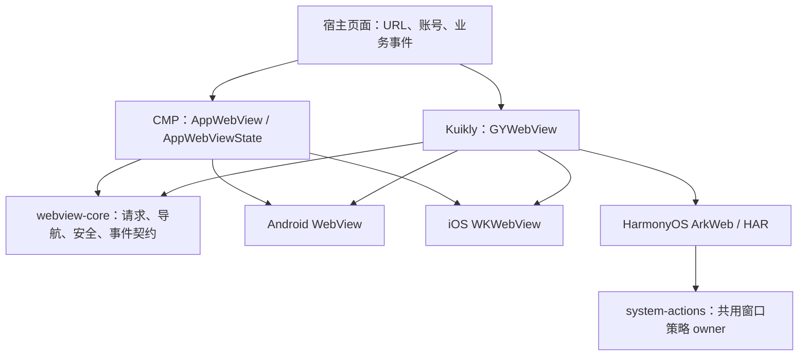
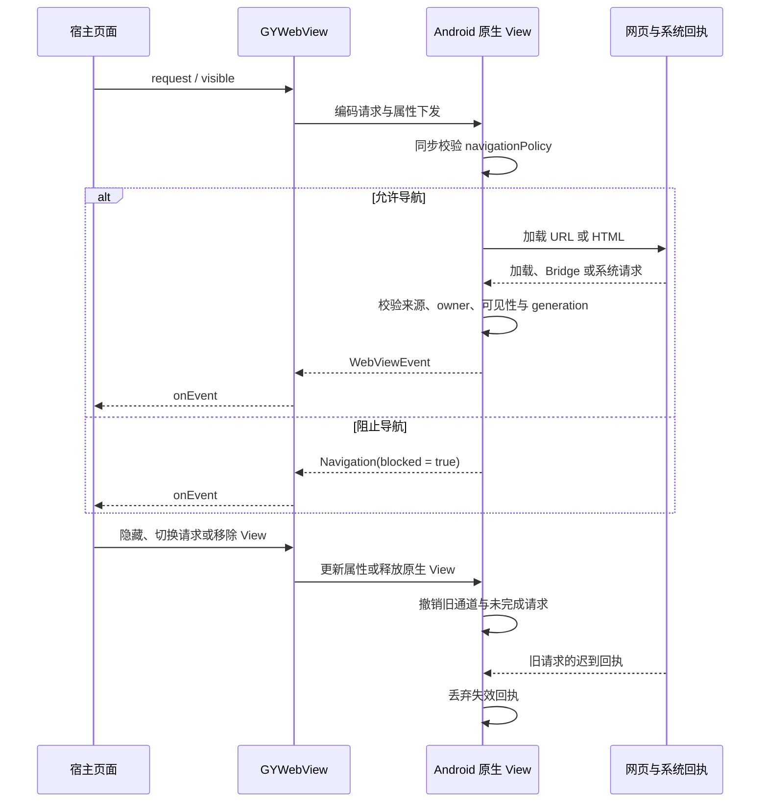
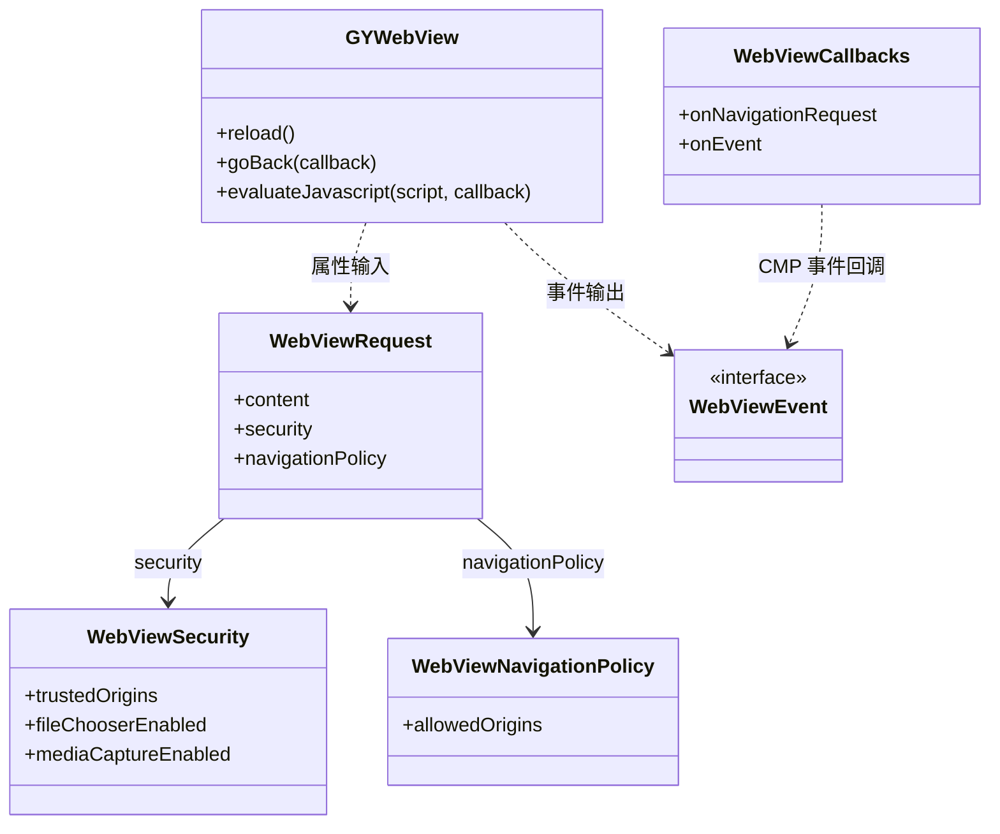

# GY CrossKit WebView

封装 Android WebView、iOS WKWebView 和 HarmonyOS ArkWeb，提供网页加载、导航、脚本、JSBridge 和生命周期管理。Compose Multiplatform（CMP）与 Kuikly 共享请求和事件契约；账号、鉴权、业务路由与页面 UI 由应用提供。

当前 Maven **0.2.0-rc.6**：严格校验 Wire JSON 的布尔、整数、header 与字符串数组类型；iOS 新声明内容重置首航提交标记，失败时重试新页面，同一声明保留站内导航与 POST 的归属。补充输入、重试及原生回调契约测试，完善 Kotlin / ArkTS / Objective-C 公共 API 注释。**已发布；JitPack、公开产物校验与干净远程消费通过**。Native Pod `0.2.0-rc.7` 已发布并通过远程 Git Pod 与 UIKit App 最终链接：修复逻辑表达式装箱为数字造成的 iOS 导航回执异常，补齐真实 JSON Boolean、原生安全开关与 WebKit 规则编译回归。Native Pod 独立升级，Maven 版本保持 `0.2.0-rc.6`，HAR 继续使用 `@gycrosskit/webview@0.2.0-rc.5`（配套 `system-actions-native` `0.2.0-rc.3`）；OHPM Registry 可安装性尚未确认。

已发布 Maven **0.2.0-rc.5** 修复 Android 原生回执归属、CMP 隐藏/导航撤销与 iOS 隐藏授权 generation。Kuikly iOS 原生源码未改，继续配套已验 Pod `0.2.0-rc.4`；HAR `0.2.0-rc.5` 更新精确 system-actions-native 依赖到 rc.3，保持共用窗口 owner，HAR 原生源码未改；新 Maven 完整归档、全变体 HTTP 与真实远程消费已通过。rc.3 的远程编译/链接已通过，但全变体下载追加检查发现三个 CMP iOS 资源 ZIP URL 404 和三个 root source 变体大小/哈希失配；rc.4 全变体 HTTP 下载、真实远程 Gradle/Git Pod 和 Release HAR 消费已通过，详见[闭合验收记录](docs/远程闭合验收.md)。OHPM `closure-rc5` 已接受审核，精确版本 Registry 查询仍为 NOTFOUND；可从[当前 Release](https://github.com/gycrosskit/compose-webview/releases/tag/0.2.0-rc.5) 下载 HAR，尚未声明 Registry 可安装。

## 架构与调用流程

先看 UI 入口，再看原生接线：CMP 和 Kuikly 共用 `webview-core` 的请求与事件，但各自创建、管理原生 View。业务 URL、账号、导航处理和页面状态由宿主提供。



CMP 原生实现随 KMP 产物提供；Kuikly 还需注册同名原生 View，iOS 配 Pod，HarmonyOS 配 HAR。两种 UI 入口的原生安装方式不能互相替代。

下面以 Kuikly Android 为例：导航规则预先下发，在原生同步判断；事件返回宿主用于观察。Bridge、文件与媒体请求另行校验可信来源，导航规则不等于高权限授权。



类图只保留接入时需要理解的公共类型；虚线表示使用关系，实线表示请求中的字段引用。



源码入口：[请求与安全](webview-core/src/commonMain/kotlin/io/github/gycrosskit/composewebview/WebViewRequest.kt)、[导航规则](webview-core/src/commonMain/kotlin/io/github/gycrosskit/composewebview/WebViewNavigationPolicy.kt)、[CMP 入口与状态](src/commonMain/kotlin/io/github/gycrosskit/composewebview/ComposeWebView.kt)、[Kuikly 入口](webview-kuikly/src/commonMain/kotlin/io/github/gycrosskit/composewebview/kuikly/GYWebView.kt)、[Android 原生接线](webview-kuikly/src/androidMain/kotlin/io/github/gycrosskit/composewebview/kuikly/GYWebViewNative.kt)。`AppWebViewState` 属于当前组合位置，不能放进 ViewModel 或跨页面复用；Kuikly 命令通过异步回调返回。

## 平台与模块

| 平台 | 入口 | 最低要求 |
| --- | --- | --- |
| Android | CMP `compose-webview`；Kuikly `webview-kuikly` | API 24；Kuikly 原生能力使用 ComponentActivity |
| iOS | CMP KLIB；Kuikly KLIB + `GYWebView` Pod | iOS 15；原生文件选择要求 iOS 18.4+ |
| HarmonyOS | `webview-kuikly` KLIB + `@gycrosskit/webview` HAR | HarmonyOS 6.0.2 / API 22；Kuikly render 2.28.0 |

UI 无关契约位于 `webview-core`，由 UI 模块传递依赖。已验证工具链：Kotlin `2.2.21-1.0.0`、CMP `1.10.3`、Kuikly core `2.28.0-2.0.21-ohos`；OHOS 插件及传递依赖仓库见 [接入指南](docs/接入指南.md#ohos-工具链仓库)。

## 安装

在 `settings.gradle.kts` 的依赖仓库中加入：

```kotlin
dependencyResolutionManagement {
    repositories {
        google()
        mavenCentral()
        maven("https://jitpack.io") {
            content { includeGroup("com.github.gycrosskit.compose-webview") }
        }
        maven("https://maven.eazytec-cloud.com/nexus/repository/maven-public/")
        maven("https://mirrors.tencent.com/nexus/repository/maven-public/")
        maven("https://mirrors.tencent.com/nexus/repository/maven-tencent/")
    }
}
```

在 KMP 的 `commonMain.dependencies` 按 UI 引擎选择：

```kotlin
// CMP Android/iOS
implementation("com.github.gycrosskit.compose-webview:compose-webview:0.2.0-rc.6")
// Kuikly Android/iOS/HarmonyOS
implementation("com.github.gycrosskit.compose-webview:webview-kuikly:0.2.0-rc.6")
```

iOS Kuikly 另外安装原生 Pod；它不替代 KMP 依赖，也不适用于 CMP 入口：

```ruby
pod 'GYWebView', :git => 'https://github.com/gycrosskit/compose-webview.git', :tag => '0.2.0-rc.7'
```

HarmonyOS 安装原生 HAR：

```bash
ohpm install @gycrosskit/webview@0.2.0-rc.5
```

## 快速使用

CMP 页面可直接加载 URL：

```kotlin
import androidx.compose.runtime.Composable
import io.github.gycrosskit.composewebview.AppWebView
import io.github.gycrosskit.composewebview.WebViewContent
import io.github.gycrosskit.composewebview.WebViewRequest

@Composable
fun ExamplePage() {
    AppWebView(request = WebViewRequest(WebViewContent.Url("https://example.com/")))
}
```

Kuikly 使用 `GYWebView` 并显式设置尺寸，使用前在各平台注册同名原生 View。Android 需要调用 `registerGYWebView()`；iOS Pod 链接 `OpenKuiklyIOSRender` 和 `-ObjC`；HarmonyOS 注册 HAR 导出的 Creator。完整示例见 [接入指南](docs/接入指南.md) 和 [HarmonyOS 接入](ohos/webview-native/README.md)。

## 能力与安全边界

- JavaScript、Bridge、文件选择及媒体采集需要显式开启，高权限能力要求可信 HTTPS 来源；TLS 错误拒绝加载。
- 导航拦截由预先下发的 `navigationPolicy` 同步判断，事件用于报告结果；`allowedOrigins` 精确匹配 scheme、host 和有效端口。
- iOS 18.4 以下不能开启原生文件选择；HarmonyOS H5 `capture` 拍摄返回 `CapabilityUnsupported(FILE_CAPTURE)`，不伪装成功或取消。
- 导航、隐藏、请求切换和销毁撤销旧消息端口、系统请求与迟到回调。应用负责业务脚本输入编码和页面生命周期。

## 文档与反馈

- [接入、导航、JSBridge 与迁移](docs/接入指南.md)
- [源码开发与验证](docs/开发与验证.md)、[验证记录](VALIDATION.md)
- [版本发布](https://github.com/gycrosskit/compose-webview/releases)、[问题反馈](https://github.com/gycrosskit/compose-webview/issues)

由 GY CrossKit 维护。反馈请附组件版本、平台/系统版本、最小复现和脱敏日志；修复通过 PR 提交。

## 许可证

[Apache-2.0](LICENSE)。系统框架和 Kuikly 依赖分别遵循其原厂许可。

## Web 数据清理（自 0.2.0-rc.3）

`AndroidWebViewDataCleaner(applicationContext)` 与 `IosWebViewDataCleaner()` 提供两个挂起函数：

- `clearResourceCache()` 仅删除资源缓存，保留Cookie/LocalStorage/IndexedDB。
- `clearWebsiteData()` 删除完整Web账号数据，等待系统异步完成。

组件在主线程执行原生操作；宿主决定普通清缓存或切环境、清自己的账号/Repository/图片缓存。取消结束调用方等待，已开始的系统删除继续；回调不得唤醒已取消的调用。

## 0.2.0-rc.5 发布候选与契约

Android 文件选择与媒体权限回执交付前核对当前 owner、可见生命周期和主页面信任；导航/隐藏撤销旧请求，
已进入平台的 ActivityResult 保留 in-flight 标记直到真实回执，避免新请求接到旧结果。媒体请求自身 origin 也须可信，允许多个可信 origin 的合法 iframe。
iOS 隐藏时撤销待交付媒体授权的 generation，重新显示不能恢复旧授权。

`navigationPolicy.allowedOrigins` 与 JS/Bridge 权限独立。调用方传入的 `Set` 可实际为可变集合，`data class.copy` 保留相同集合引用；
沿用每次解析，不增加可能失效的归一化缓存。直接生产 Android controller 的回调契约入口为 `bash verification/android-callbacks/verify.sh`。

本轮 core Android 46 项、CMP Android 16 项测试、Android/iOS arm64/Simulator 编译，以及 16 项直接生产 controller 回调契约和 OHOS Node 契约通过。
iOS 隐藏后授权的 generation 边界已检查并编译，未在设备驱动系统权限/UI；测试替身不能代替系统验收。

| 当前候选渠道 | 配套版本 |
| --- | --- |
| Maven / Git Pod / Release HAR | `0.2.0-rc.5` / `0.2.0-rc.4` / `0.2.0-rc.5` |

Kuikly Render 2.28.0；HAR 配 system-actions-native 0.2.0-rc.3（宿主同版，独立消费者核单一解析）；OHPM 审核状态另核。候选已完成发布与新版本远程消费；设备行为不由编译/链接推断。

## 0.2.0-rc.5 发布与远程验收

Fresh macOS staging 与归档解包复验均通过，全部 17 个 publication 的声明文件四类哈希、四类 sidecar、Apache-2.0 POM 及同名 available-at 目标身份均已校验。Maven 归档 SHA-256：`98f5318086f0ec008cf0c8c540c5d23592f82d644980d8b3153b5e2ccf01be3a`。

Maven / Release HAR `0.2.0-rc.5`；未变 Swift Pod 保留 `0.2.0-rc.4`；HAR 精确配 system-actions-native `0.2.0-rc.3` / Render `2.28.0`。

不可变标签与 prerelease 已发布，所有 Release 附件重下载 SHA 与清单匹配。JitPack 新版本最终 ok/isTag/public 且 commit 匹配 tag，全部 17 module、20 个文件引用、17 个 available-at 的 HTTP/四类声明 hash/身份验证通过。新版真实远程 consumer 已通过；设备与业务 SDK 动作未验。


精确 JitPack rc.5 新目录消费者：Kuikly 43 tasks / 35s，APK/D8、verifyNoCompose、精确版本、iOS 三架构编译及 device/simulator Framework、OHOS aarch64 .so；CMP 19 tasks / 18s，Android/iOS 三架构编译。两份实际下载的 Release HAR（Web rc.5 / system-actions rc.3）在新目录 consumer 30/30 tasks 通过，actual HAR 契约通过；lock 仅一份 rc.3，宿主直接导入与 Web 传递导入的 owner realpath 相同。生成 HAR lock 记录构建时相对 override 缓存路径，公开 manifest 为精确版本依赖；消费者使用自己的 root override，无需发布机器旧缓存。OHPM closure-rc5 已接受并 under review，精确 info 仍 NOTFOUND，Registry 安装未通过。

实际日志与 JSON 账单位于 `build/remote-library-review/`。真实设备、业务账号登录/聊天/直播/PiP、权限 UI、真实 Bug/通知发送未执行。

## iOS Native Pod 0.2.0-rc.7 验收

这是独立 iOS 原生补修版本，配套 Maven `0.2.0-rc.6` 和 HAR `0.2.0-rc.5`（system-actions HAR `0.2.0-rc.3`），不发布 Maven/HAR `0.2.0-rc.7`。ObjC 的逻辑/比较结果不再作为数字0/1输出，原生安全开关拒绝数字伪布尔；真实 WebKit 内容规则回归发现的正则disjunction替换为可选路径和末尾锚点，保留host边界。

[Native Release](https://github.com/gycrosskit/compose-webview/releases/tag/0.2.0-rc.7) 的标签提交 `21453637194fb5551f375a0811e80be7f0cebed4` 与重新下载的源码归档SHA-256 `fa0faab8db41747f9818d05405268c78188fd075093add5d9edc76e0232c2604` 已核验。全新 CocoaPods 工程从真实 Git/tag 安装，参与实际 ObjC 编译的 `.m` 与关联 `.h/.inc` 文件逐字节一致，纯UIKit iphoneos arm64 App链接通过；Simulator生产源码回归及Kotlin Android/iOS事件回归通过。原机闪退与页面性能由宿主升级后复验，不由这些构建结果推断。

## 0.2.0-rc.6 本轮测试与远程验收

2026-10-05：本轮自有源码和公开 API 审查、关键回归与受影响平台编译通过；真实 JitPack `0.2.0-rc.6` 的最终标签提交、17 个 publications 的 POM/Module、所有变体文件大小与四种声明哈希、内部精确版本及 available-at 均通过。Release Maven 归档重新下载 SHA-256 为 `0df6961df3b29518ca505433f3c1fe0f79bcfdf44e8c2831b73351762f335aba`。公开 MD5/SHA-1 sidecar 通过；SHA-256/SHA-512 sidecar 的 HTTP 404 记录为渠道缺失。

干净消费工程使用固定远程版本，没有本地 Maven、includeBuild 或其他组件源码替代；通过现有入口的 Android/iOS / OHOS 编译和相应最终链接。 Kuikly 与 CMP 分别验证。

完整回归范围、精简原则、注释契约与仍需设备/业务验收的边界见 [14 个功能组件测试与 API 审查](https://github.com/gycrosskit/.github/blob/main/docs/组件测试与API审查.md)。源码测试与远程消费不代替真机和厂商业务验收。
