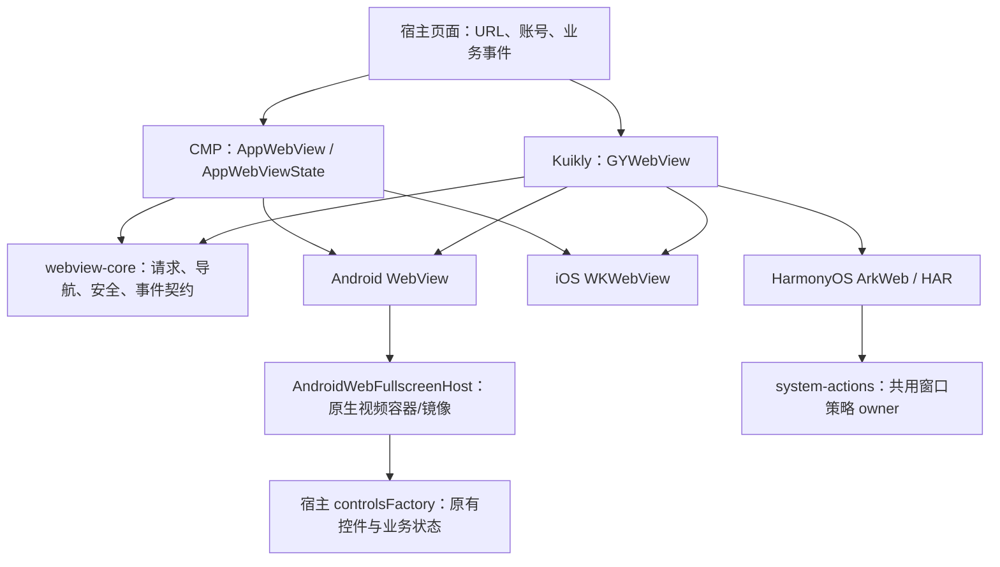
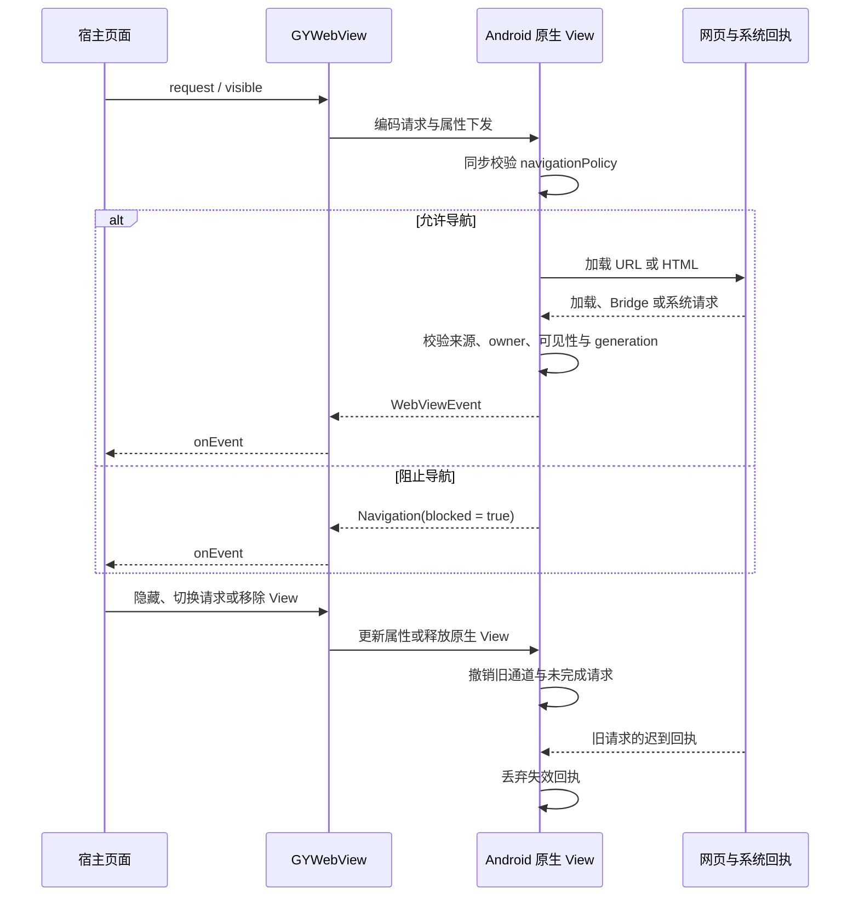
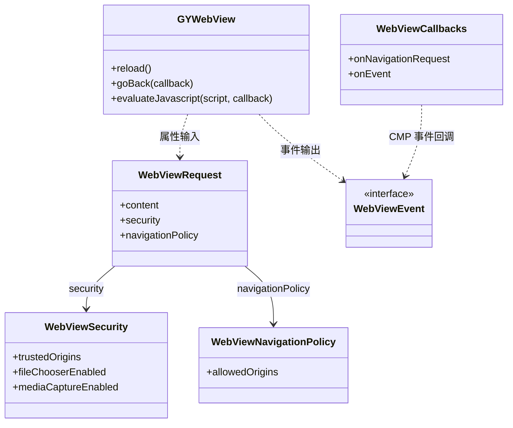

# GY CrossKit WebView

2026-10-08 功能索引：core提供请求/安全/导航，根模块提供CMP Android/iOS，webview-kuikly提供raw与KuiklyCompose Android/iOS/OHOS；任意同步导航决策、iOS禁图/文件选择和OHOSCookie等仍有明确差异。 详见[功能与平台差异](docs/功能与平台差异.md)，含固定基线、五入口矩阵、真实回归与未验收范围。当前发布组合：Maven/Git Pod 0.2.0-rc.14；OHOS HAR 0.2.0-rc.13，配套system-actions-native 0.2.0-rc.4。各渠道消费与设备验收分别核对。

最终核对（2026-10-08）：本轮重跑生产模型Compose接线与OHOS合同；真实WK/手势/consumer复用前轮，原生节点替身不是Renderer验收。 逐项时点与边界见[验证范围](docs/功能与平台差异.md#sdk系统与真实验证范围)。

Maven `0.2.0-rc.14`新增 `io.github.gycrosskit.composewebview.kuikly.AppWebView` Composable，此入口从本次版本提供；已发布 CMP 同名入口位于 `io.github.gycrosskit.composewebview`，raw `GYWebView` 保留兼容。`webview-kuikly` 现在传递依赖 KuiklyCompose / Compose runtime，宿主统一 Kuikly 与 compiler 版本；没有引入第二套 JetBrains CMP UI。独立消费可用 `-PverifyKuiklyCompose -PverifyLocalSource` 验证本地源码；远程验收使用 `-PremoteOnly -PwebViewVersion=0.2.0-rc.14`。新的 `verifyNoCmpUi` 门禁允许 KuiklyCompose/runtime 并拒绝第二套 CMP UI；开启 API probe 时另确认 KuiklyCompose 确实存在，历史远程基线 raw API 仍可验证。

封装 Android WebView、iOS WKWebView 和 HarmonyOS ArkWeb，提供网页加载、导航、脚本、JSBridge 和生命周期管理。Compose Multiplatform（CMP）与 Kuikly 共享请求和事件契约；账号、鉴权、业务路由与页面 UI 由应用提供。

当前 Maven / Kuikly iOS Git Pod 为 **0.2.0-rc.14**：默认关闭的 `pageMessageChannels` 提供初始完整 HTTP(S) 主页面的具名早期双向 string 通道。Android/iOS 每次声明加载与显式 reload 重建物理 owner；隐藏、停止、后续主文档导航和释放同步撤销。OHOS HAR **0.2.0-rc.13** 的 v2 实现通过 document-start 引导初始主文档 capability；隐藏、停止和导航后须显式 reload 新建 owner，不由 show 恢复。默认空配置保留既有行为；配套 system-actions-native **0.2.0-rc.4** 与 Render **2.28.0**。详见[早期通道候选验收](docs/早期页面通道候选验收.md)。

历史 Maven / Git Pod **rc.12** 不包含早期具名通道（与 OHOS HAR rc.12 的独立版本号区分）。其 CMP 前进历史、返回/退出全屏回执、共享异步退出脚本与旧 owner/取消修复在 rc.13 中保留；历史源码验证见 [rc.12 候选验收](docs/0.2.0-rc.12候选验收.md)。

iOS 常规网页最低仍为 15.0；受控文件上传通过公开 `WKUIDelegate.runOpenPanelWithParameters`，要求 iOS18.4+。15～18.3 开启 `fileChooserEnabled` 会明确拒绝并发送 `FILE_CHOOSER` Unsupported；关闭能力时的 DOM 兼容拦截无法保证默认 WebKit 上传被原生隔离。需要这种隔离的页面应使用 18.4+。本版在仅接受 MP4 时通过 AVAssetExportSession 转换系统 MOV；输入与最终文件分别校验 50 MiB 上限，转码临时文件不承诺流过程磁盘上限。见[完整源码审查与平台边界](docs/完整源码审查.md)。

已发布 Maven / Release HAR **0.2.0-rc.8**：Android Kuikly 与 OHOS 当前文档隐藏时仍完成初始化脚本，恢复可见仅恢复活动状态/Bridge，不重载页面；DOM_READY 与 DOCUMENT_FINISHED 每文档执行一次，保留 JS、可信主文档、旧 owner/render/generation 以及隐藏业务消息/权限门禁。iOS 已有 WKUserScript 与完成回调支持隐藏初始化，Native Pod 保持 `0.2.0-rc.7`。源码回归、JitPack 全制品校验、CMP/Kuikly 干净远程消费与实际 Release HAR 消费通过；Web HAR 的 OHPM 审核中，精确版本仍 NOTFOUND。配套 system-actions HAR rc.3 已从 Registry 实际安装。详见 [rc.8 远程发布验收](docs/0.2.0-rc.8远程发布验收.md)，设备验收独立记录。

已发布 Maven **0.2.0-rc.6**：严格校验 Wire JSON 的布尔、整数、header 与字符串数组类型；iOS 新声明内容重置首航提交标记，失败时重试新页面，同一声明保留站内导航与 POST 的归属。补充输入、重试及原生回调契约测试，完善 Kotlin / ArkTS / Objective-C 公共 API 注释。**已发布；JitPack、公开产物校验与干净远程消费通过**。Native Pod `0.2.0-rc.7` 已发布并通过远程 Git Pod 与 UIKit App 最终链接：修复逻辑表达式装箱为数字造成的 iOS 导航回执异常，补齐真实 JSON Boolean、原生安全开关与 WebKit 规则编译回归。Native Pod 独立升级，Maven 版本保持 `0.2.0-rc.6`，HAR 继续使用 `@gycrosskit/webview@0.2.0-rc.5`（配套 `system-actions-native` `0.2.0-rc.3`）；OHPM Registry 可安装性尚未确认。

已发布 Maven **0.2.0-rc.5** 修复 Android 原生回执归属、CMP 隐藏/导航撤销与 iOS 隐藏授权 generation。Kuikly iOS 原生源码未改，继续配套已验 Pod `0.2.0-rc.4`；HAR `0.2.0-rc.5` 更新精确 system-actions-native 依赖到 rc.3，保持共用窗口 owner，HAR 原生源码未改；新 Maven 完整归档、全变体 HTTP 与真实远程消费已通过。rc.3 的远程编译/链接已通过，但全变体下载追加检查发现三个 CMP iOS 资源 ZIP URL 404 和三个 root source 变体大小/哈希失配；rc.4 全变体 HTTP 下载、真实远程 Gradle/Git Pod 和 Release HAR 消费已通过，详见[闭合验收记录](docs/远程闭合验收.md)。OHPM `closure-rc5` 已接受审核，精确版本 Registry 查询仍为 NOTFOUND；可从[历史 rc.5 Release](https://github.com/gycrosskit/compose-webview/releases/tag/0.2.0-rc.5) 下载 HAR，尚未声明 Registry 可安装。

## 架构与调用流程

先看 UI 入口，再看原生接线：CMP 和 Kuikly 共用 `webview-core` 的请求与事件，但各自创建、管理原生 View。业务 URL、账号、导航处理和页面状态由宿主提供。



CMP 原生实现随 KMP 产物提供；Kuikly 还需注册同名原生 View，iOS 配 Pod，HarmonyOS 配 HAR。两种 UI 入口的原生安装方式不能互相替代。

下面以 Kuikly Android 为例：导航规则预先下发，在原生同步判断；事件返回宿主用于观察。Bridge、文件与媒体请求另行校验可信来源，导航规则不等于高权限授权。



类图只保留接入时需要理解的公共类型；虚线表示使用关系，实线表示请求中的字段引用。



源码入口：[请求与安全](webview-core/src/commonMain/kotlin/io/github/gycrosskit/composewebview/WebViewRequest.kt)、[导航规则](webview-core/src/commonMain/kotlin/io/github/gycrosskit/composewebview/WebViewNavigationPolicy.kt)、[CMP 入口与状态](src/commonMain/kotlin/io/github/gycrosskit/composewebview/ComposeWebView.kt)、[Kuikly 入口](webview-kuikly/src/commonMain/kotlin/io/github/gycrosskit/composewebview/kuikly/GYWebView.kt)、[Android 原生接线](webview-kuikly/src/androidMain/kotlin/io/github/gycrosskit/composewebview/kuikly/GYWebViewNative.kt)。`AppWebViewState` 属于当前组合位置，不能放进 ViewModel 或跨页面复用；Kuikly 命令通过异步回调返回。

具名早期双向消息通道自 Maven / Git Pod rc.13 与 OHOS HAR rc.12 提供，当前使用 rc.14 / HAR rc.13：`pageMessageChannels` 显式指定 `window[channel].postMessage(string)` / `onmessage(event.data)`，默认关闭；宿主用单次 `replyPageMessage` 回复。三端仅初始完整 HTTP(S) 主页面获得 capability，隐藏、停止和后续导航撤销；恢复必须显式 reload 重建 owner。接线与边界见[接入指南](docs/接入指南.md#具名早期双向页面通道)。

## 平台与模块

| 平台 | 入口 | 最低要求 |
| --- | --- | --- |
| Android | CMP `compose-webview`；Kuikly `webview-kuikly` | API 24；Kuikly 原生能力使用 ComponentActivity |
| iOS | CMP KLIB；Kuikly KLIB + `GYWebView` Pod | iOS 15；原生文件选择要求 iOS 18.4+ |
| HarmonyOS | `webview-kuikly` KLIB + `@gycrosskit/webview` HAR | HarmonyOS 6.0.2 / API 22；Kuikly render 2.28.0 |

UI 无关契约位于 `webview-core`，由 UI 模块传递依赖。已验证工具链：Kotlin `2.2.21-1.0.0`、CMP `1.10.3`、Kuikly core `2.28.0-2.0.21-ohos`；OHOS 插件及传递依赖仓库见 [接入指南](docs/接入指南.md#ohos-工具链仓库)。

## 安装

在 `settings.gradle.kts` 的依赖仓库中加入：

```kotlin
dependencyResolutionManagement {
    repositories {
        google()
        mavenCentral()
        maven("https://jitpack.io") {
            content { includeGroup("com.github.gycrosskit.compose-webview") }
        }
        maven("https://maven.eazytec-cloud.com/nexus/repository/maven-public/")
        maven("https://mirrors.tencent.com/nexus/repository/maven-public/")
        maven("https://mirrors.tencent.com/nexus/repository/maven-tencent/")
    }
}
```

以下为当前Maven/Git Pod 0.2.0-rc.14安装方式，包含新增KuiklyCompose AppWebView；OHOS HAR单独使用0.2.0-rc.13。在 KMP 的 `commonMain.dependencies` 按 UI 引擎选择：

```kotlin
// CMP Android/iOS
implementation("com.github.gycrosskit.compose-webview:compose-webview:0.2.0-rc.14")
// Kuikly Android/iOS/HarmonyOS
implementation("com.github.gycrosskit.compose-webview:webview-kuikly:0.2.0-rc.14")
```

iOS Kuikly 另外安装原生 Pod；它不替代 KMP 依赖，也不适用于 CMP 入口：

```ruby
pod 'GYWebView', :git => 'https://github.com/gycrosskit/compose-webview.git', :tag => '0.2.0-rc.14'
```

HarmonyOS HAR rc.13的Registry可安装性单独核验；从[本次Release](https://github.com/gycrosskit/compose-webview/releases/tag/0.2.0-rc.14) 下载 `WebViewNative.har`，配套实际 system-actions-native rc.4 HAR，按[HAR 接入指南](ohos/webview-native/README.md)的 root override 安装。不能把审核受理当作 Registry 可安装。

## 快速使用

以下是已发布 CMP `io.github.gycrosskit.composewebview.AppWebView` 示例；KuiklyCompose同名函数自0.2.0-rc.14提供，使用不同package，见[入口与差异](docs/功能与平台差异.md)。CMP 页面可直接加载 URL：

```kotlin
import androidx.compose.runtime.Composable
import io.github.gycrosskit.composewebview.AppWebView
import io.github.gycrosskit.composewebview.WebViewContent
import io.github.gycrosskit.composewebview.WebViewRequest

@Composable
fun ExamplePage() {
    AppWebView(request = WebViewRequest(WebViewContent.Url("https://example.com/")))
}
```

Kuikly 使用 `GYWebView` 并显式设置尺寸，使用前在各平台注册同名原生 View。Android 需要调用 `registerGYWebView()`；iOS Pod 链接 `OpenKuiklyIOSRender` 和 `-ObjC`；HarmonyOS 注册 HAR 导出的 Creator。完整示例见 [接入指南](docs/接入指南.md) 和 [HarmonyOS 接入](ohos/webview-native/README.md)。

## 能力与安全边界

- JavaScript、Bridge、文件选择及媒体采集需要显式开启，高权限能力要求可信 HTTPS 来源；TLS 错误拒绝加载。
- 导航拦截由预先下发的 `navigationPolicy` 同步判断，事件用于报告结果；`allowedOrigins` 精确匹配 scheme、host 和有效端口。
- rc.11 增加 `allowedUrls`，按完整 URL 字符串同步限制主文档，与 scheme、来源和拒绝规则同时生效；空集合不增加限制，不归一化默认端口、路径、查询或 fragment，也不限制 iframe/子资源。
- iOS 18.4 以下不能开启受控原生文件选择，返回 `CapabilityUnsupported(FILE_CHOOSER)`；旧系统的 DOM 拦截不能保证原生文件隔离。iOS18.4+ 与 HarmonyOS H5 `capture` 复用系统拍摄能力，核验权限、来源、文档代次、MIME 和大小；取消/失败不回传文件，成功临时文件在文档撤销时清理。
- 导航、隐藏、请求切换和销毁撤销旧消息端口、系统请求与迟到回调。隐藏不取消当前文档初始化：脚本仍受 JavaScript 开关与可信主文档门禁，显示不会重跑副作用脚本或重载页面。应用负责业务脚本输入编码和页面生命周期。

明确开启 `pageBridgeEnabled` 的初始 HTTP(S) 页面可执行同源业务脚本，沿用手动 `evaluateJavascript` 的低权限边界；`onlyForTrustedMainFrame` 保持开启。HTTP 不能进入高权限 HTTPS 白名单，也不因此获得文件或媒体权限。仅允许一个旧页面时同时设置 `allowedUrls = setOf(pageUrl)`。CMP/Kuikly 原生背景默认透明，页面自己的 CSS 背景由 H5 控制。

Android 旧内核不支持 document-start 时仍会晚注入；需要先于 H5 启动的协议必须由宿主校验 READY/版本并在错误或超时时失败关闭。Android Bridge 的文档 nonce 在提交后安装，单次早期 READY 可由页面专属 facade 暂存，宿主收到 `FirstContentVisible` 后用已有脚本命令冲刷。协议映射、输入 JSON 编码和业务状态留在宿主，不新增业务原生通道。

## 文档与反馈

- [rc.11 发布准备与验收](docs/0.2.0-rc.11发布验收.md)
- [接入、导航、JSBridge 与迁移](docs/接入指南.md)
- [源码开发与验证](docs/开发与验证.md)、[验证记录](VALIDATION.md)、[完整源码审查](docs/完整源码审查.md)、[rc.9 本地候选验收](docs/0.2.0-rc.9候选验收.md)、[rc.9 远程发布验收](docs/0.2.0-rc.9远程发布验收.md)
- [版本发布](https://github.com/gycrosskit/compose-webview/releases)、[问题反馈](https://github.com/gycrosskit/compose-webview/issues)

由 GY CrossKit 维护。反馈请附组件版本、平台/系统版本、最小复现和脱敏日志；修复通过 PR 提交。

## 许可证

[Apache-2.0](LICENSE)。系统框架和 Kuikly 依赖分别遵循其原厂许可。

## Web 数据清理

清理针对应用共享 Web 数据，时机、业务账号、Repository 和图片缓存由宿主控制。清理时停止相关页面继续写入；不以系统 API 返回证明业务退出。

| 平台 / 首次版本 | 入口 | `clearResourceCache()` | `clearWebsiteData()` |
| --- | --- | --- | --- |
| Android / rc.3 | `AndroidWebViewDataCleaner(applicationContext)` | 挂起；资源缓存 | 挂起；资源缓存、WebStorage、Cookie，等待 Cookie 回执并 flush |
| iOS / rc.3 | `IosWebViewDataCleaner()` | 挂起；默认 WKWebsiteDataStore 内存/磁盘缓存 | 挂起；默认 store 全部网站数据，等待 WebKit completion |
| HarmonyOS / 自rc.10提供 | HAR `OhosWebViewDataCleaner` 静态方法 | 同步；共享内存/磁盘资源缓存 | Promise；缓存 → 等待 Cookie 删除 → WebStorage |

资源缓存清理保留 Cookie 与网站存储。Android/iOS 自动切到 Main；HarmonyOS 由宿主在 UI 线程、Web 组件加载后调用，Cookie 与 WebStorage 操作默认非隐私存储。ArkWeb 缓存与 WebStorage 没有完成回调，网站清理 Promise 只确认 Cookie 删除完成及其余 API 已返回，不承诺所有内核数据类型或持久化完成。

```ts
import { OhosWebViewDataCleaner } from '@gycrosskit/webview';

// 普通缓存清理，保留网站账号。
OhosWebViewDataCleaner.clearResourceCache();
// 宿主切环境/退出网页账号时调用；系统异常继续向调用方传播。
await OhosWebViewDataCleaner.clearWebsiteData();
```

两类调用均保留系统错误。取消等待或销毁宿主不撤销已发起删除；Kuikly 宿主沿用自身 requestId/取消/销毁协议，只向仍有效的调用投递完成或失败，清理器不引入 Module、全局状态或业务成功回执。

## 0.2.0-rc.5 发布候选与契约

Android 文件选择与媒体权限回执交付前核对当前 owner、可见生命周期和主页面信任；导航/隐藏撤销旧请求，
已进入平台的 ActivityResult 保留 in-flight 标记直到真实回执，避免新请求接到旧结果。媒体请求自身 origin 也须可信，允许多个可信 origin 的合法 iframe。
iOS 隐藏时撤销待交付媒体授权的 generation，重新显示不能恢复旧授权。

`navigationPolicy.allowedOrigins` 与 JS/Bridge 权限独立。调用方传入的 `Set` 可实际为可变集合，`data class.copy` 保留相同集合引用；
沿用每次解析，不增加可能失效的归一化缓存。直接生产 Android controller 的回调契约入口为 `bash verification/android-callbacks/verify.sh`。

本轮 core Android 46 项、CMP Android 16 项测试、Android/iOS arm64/Simulator 编译，以及 16 项直接生产 controller 回调契约和 OHOS Node 契约通过。
iOS 隐藏后授权的 generation 边界已检查并编译，未在设备驱动系统权限/UI；测试替身不能代替系统验收。

| rc.5 发布时渠道 | 配套版本 |
| --- | --- |
| Maven / Git Pod / Release HAR | `0.2.0-rc.5` / `0.2.0-rc.4` / `0.2.0-rc.5` |

Kuikly Render 2.28.0；HAR 配 system-actions-native 0.2.0-rc.3（宿主同版，独立消费者核单一解析）；OHPM 审核状态另核。候选已完成发布与新版本远程消费；设备行为不由编译/链接推断。

## 0.2.0-rc.5 发布与远程验收

Fresh macOS staging 与归档解包复验均通过，全部 17 个 publication 的声明文件四类哈希、四类 sidecar、Apache-2.0 POM 及同名 available-at 目标身份均已校验。Maven 归档 SHA-256：`98f5318086f0ec008cf0c8c540c5d23592f82d644980d8b3153b5e2ccf01be3a`。

Maven / Release HAR `0.2.0-rc.5`；未变 Swift Pod 保留 `0.2.0-rc.4`；HAR 精确配 system-actions-native `0.2.0-rc.3` / Render `2.28.0`。

不可变标签与 prerelease 已发布，所有 Release 附件重下载 SHA 与清单匹配。JitPack 新版本最终 ok/isTag/public 且 commit 匹配 tag，全部 17 module、20 个文件引用、17 个 available-at 的 HTTP/四类声明 hash/身份验证通过。新版真实远程 consumer 已通过；设备与业务 SDK 动作未验。


精确 JitPack rc.5 新目录消费者：Kuikly 43 tasks / 35s，APK/D8、verifyNoCompose、精确版本、iOS 三架构编译及 device/simulator Framework、OHOS aarch64 .so；CMP 19 tasks / 18s，Android/iOS 三架构编译。两份实际下载的 Release HAR（Web rc.5 / system-actions rc.3）在新目录 consumer 30/30 tasks 通过，actual HAR 契约通过；lock 仅一份 rc.3，宿主直接导入与 Web 传递导入的 owner realpath 相同。生成 HAR lock 记录构建时相对 override 缓存路径，公开 manifest 为精确版本依赖；消费者使用自己的 root override，无需发布机器旧缓存。OHPM closure-rc5 已接受并 under review，精确 info 仍 NOTFOUND，Registry 安装未通过。

实际日志与 JSON 账单位于 `build/remote-library-review/`。真实设备、业务账号登录/聊天/直播/PiP、权限 UI、真实 Bug/通知发送未执行。

## iOS Native Pod 0.2.0-rc.7 验收

这是独立 iOS 原生补修版本，配套 Maven `0.2.0-rc.6` 和 HAR `0.2.0-rc.5`（system-actions HAR `0.2.0-rc.3`），不发布 Maven/HAR `0.2.0-rc.7`。ObjC 的逻辑/比较结果不再作为数字0/1输出，原生安全开关拒绝数字伪布尔；真实 WebKit 内容规则回归发现的正则disjunction替换为可选路径和末尾锚点，保留host边界。

[Native Release](https://github.com/gycrosskit/compose-webview/releases/tag/0.2.0-rc.7) 的标签提交 `21453637194fb5551f375a0811e80be7f0cebed4` 与重新下载的源码归档SHA-256 `fa0faab8db41747f9818d05405268c78188fd075093add5d9edc76e0232c2604` 已核验。全新 CocoaPods 工程从真实 Git/tag 安装，参与实际 ObjC 编译的 `.m` 与关联 `.h/.inc` 文件逐字节一致，纯UIKit iphoneos arm64 App链接通过；Simulator生产源码回归及Kotlin Android/iOS事件回归通过。原机闪退与页面性能由宿主升级后复验，不由这些构建结果推断。

## 0.2.0-rc.6 本轮测试与远程验收

2026-10-05：本轮自有源码和公开 API 审查、关键回归与受影响平台编译通过；真实 JitPack `0.2.0-rc.6` 的最终标签提交、17 个 publications 的 POM/Module、所有变体文件大小与四种声明哈希、内部精确版本及 available-at 均通过。Release Maven 归档重新下载 SHA-256 为 `0df6961df3b29518ca505433f3c1fe0f79bcfdf44e8c2831b73351762f335aba`。公开 MD5/SHA-1 sidecar 通过；SHA-256/SHA-512 sidecar 的 HTTP 404 记录为渠道缺失。

干净消费工程使用固定远程版本，没有本地 Maven、includeBuild 或其他组件源码替代；通过现有入口的 Android/iOS / OHOS 编译和相应最终链接。 Kuikly 与 CMP 分别验证。

完整回归范围、精简原则、注释契约与仍需设备/业务验收的边界见 [14 个功能组件测试与 API 审查](https://github.com/gycrosskit/.github/blob/main/docs/组件测试与API审查.md)。源码测试与远程消费不代替真机和厂商业务验收。

## 自动回归

PR 和 `main` push 运行 `Source regression`，复用已有单元测试与契约测试，并分别编译 Android、iOS 及实际声明的 OHOS Kotlin target。`native` 在 `macos-15` 执行实际存在的 iOS Simulator 单测；Swift mock 和 Node transpile 测试仅证明回调协议。

`Release validation` 在 Release 发布或手动填写精确 Maven tag 时下载归档，检查 `release-checksums.txt` 的 SHA-256、POM/Module、变体引用和声明哈希，再用现有独立消费工程从 JitPack 解析 Android/iOS/OHOS 各实际平台。不存在的版本或变体直接失败；不使用 `mavenLocal`、本库源码或归档替代远程依赖。CI 不发布二进制、不执行供应商业务请求。

GitHub-hosted runner 的实际结果以 Actions 为准；没有 DevEco/ohpm runner，因此 HAR 构建、ohpm Registry 安装、完整原生 SDK 集成和真机业务验收仍按既有验证文档执行，不能由这些 job 的成功代算。

远程 Android 消费分别以 Kuikly-only 和 CMP-only 配置编译，并检查两者运行时依赖隔离。原生 Kuikly iOS 消费编译 API；其真实 Render Framework 最终链接仍需既有脚本的 SDK 参数。CMP-only iOS Simulator 消费单独链接 Framework。

PR 的远程验收固定使用已发布 `0.2.0-rc.9` 作为回归基线，验证 CI 检查器及消费工程；这不代表 PR 候选源码已经发布。正式 Release 事件始终使用事件自己的精确 tag，手动运行也必须填写精确已发布版本。

公网核验同步组织 `templates/check-public-maven.py`：使用冻结归档给出的完整 publications 清单，核对 JitPack tag/commit、每个公开 POM/Module、全部声明变体字节大小和四类哈希、内部精确版本及 `available-at`；MD5/SHA-1 sidecar 必须匹配。SHA-256/SHA-512 sidecar 的 HTTP 404 单独输出为渠道缺失，不计为校验通过。

OHOS Node 契约使用 manifest 声明的 System Actions `0.2.0-rc.4` Release HAR：下载并核对冻结 SHA-256 后读取真实 WindowPolicy 源文件，避免依赖本机已安装的 `oh_modules`。这只证明源码契约，不等于 HAR 构建或 OHPM Registry 安装。

### CMP 与 Kuikly 的网页命令

两种入口均支持返回、前进、停止、重载和退出全屏。CMP `snapshot.canGoBack/canGoForward` 可驱动历史按钮；`state.goForward()` 无历史时返回 false。返回优先退出全屏再走历史，`state.goBack { consumed -> }` 与 `state.exitFullscreen { consumed -> }` 交付最终消费结果。iOS 需要异步验证 DOM/视频全屏退出；兼容的 `state.goBack(): Boolean` 在全屏时只表示请求受理，需要最终结果时使用回调重载。文档/owner结束时已受理命令以 false 取消一次，迟到原生回执忽略，不会回退新实例的历史。OHOS UI 由 Kuikly/Kuikly Compose 承载，未提供独立 JetBrains CMP OHOS 运行时。

## 0.2.0-rc.14 平台修复与入口

OHOS 允许的 popup 经现有导航、来源与 owner 门禁复用当前页面；自动脚本 popup 另受 `javaScriptCanOpenWindowsAutomatically` 控制。文字使用 ArkWeb `textZoomRatio` 跟随系统字体并按上下限 clamp；深色模式跟随系统，`algorithmicDarkeningAllowed` 控制强制暗化。订阅失败保留基本页面加载。

iOS 两入口在 `supportZoom=false` 时通过单源 document-start 脚本设置 author viewport `user-scalable=no`，保留原页面其他参数，并关闭 `ignoresViewportScaleLimits`。系统可访问性强制缩放仍优先，不能将该展示设置用作安全边界；实际手势约束需设备验收。`NEVER_ALLOW` 在 HTTPS 顶文档加载前安装 Content Rule List 阻止 HTTP 子资源，保留 HTTP 顶文档；规则与 `blockedResourceRules` 合并，编译失败拒绝加载。`COMPATIBILITY` 使用同一保守策略，无法复制 Android 内核启发式；`ALWAYS_ALLOW` 仅取消组件额外拦截，仍受 WebKit 与 ATS 自身限制。

iOS 没有与 Android 完全等价的公开 DOM Storage 禁用、平台缩放按钮、宽视口/overview、系统 textZoom 和算法暗化开关；这些设置不通过 CSS 冒充原生等价。平台支持边界以 `WebViewSettings` 注释和[源码审查](docs/完整源码审查.md)为准。

iOS `blockNetworkImage` 通过原生 Content Rule List 阻止 HTTP(S) 图片，保留 data/本地图片；规则与混合内容及显式资源过滤合并。`loadsImagesAutomatically=false` 在 iOS 仍无保真等价：真实 WK 测试中全 URL image 规则仍放行 data 图片，已撤销该不完整实现。

本版 HTML 合同：两套 iOS 入口按声明 MIME 与已知 charset 无损编码后 loadData；未知/无法表示编码明确 LOAD_EXCEPTION。historyUrl 仅 null 或与 baseUrl 相等可兑现，其他值明确失败，不使用 JS 改写地址模拟。Android/OHOS 非UTF8行为仍需各内核验收。
